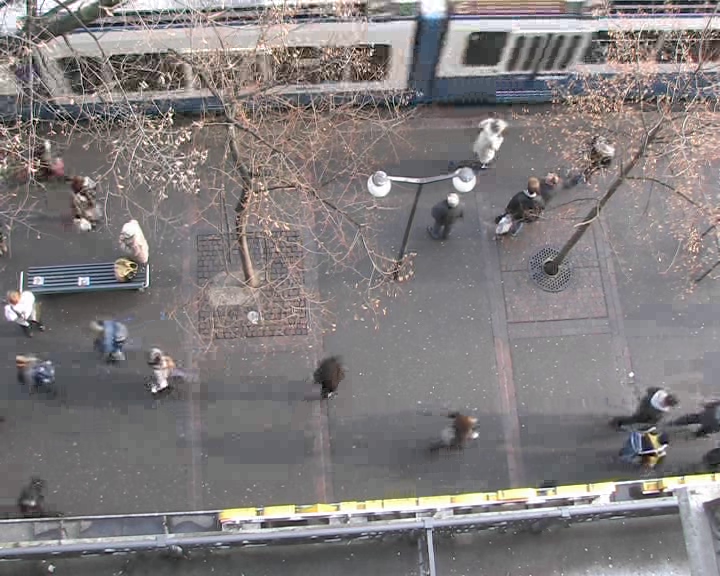

# ETH Walking Pedestrians Dataset (EWAP)
This dataset contains two experiments coined as ETH (left image) and Hotel (right image):
<p align='center'>
  
  
</p>

* This dataset is extensively used in Human Trajectory Prediction literature.

## Annotations

Each directory contains a video together with the annotation and the obstacle map used. Please read the following for some details about the provided files. In each sequence directory there is a info.txt file with some sequence specific information.

#### OBSMAT
The actual annotation is stored in the obsmat.txt file. Each line has this format

```
[frame_number pedestrian_ID pos_x pos_z pos_y v_x v_z v_y ]
```

however `pos_z` and `v_z` (direction perpendicular to the ground) are not used. The positions and velocities are in meters and are obtained with the homography matrix stored in H.txt .
Please note that we tried to avoid annotating those subjects that were at the border of the scene, as their behavior might have been influenced by the presence of other pedestrians/obstacles not in the field of view of the camera. We tried to be as consistent as possible in this regard. 

#### GROUPS
We tried to keep note of the people that seemed to walk in groups. These are listed in the file groups.txt . Each line contains a list of id, that are those that form a group. The id are the same as those in the obsmat.txt file 

#### DESTINATIONS
The assumed destinations for all the subjects walking in the scene are stored in the file destinations.txt . This is of course a simplifyiing assumption, but it seems to work fine for us.

#### OBSTACLES
the obstacles are reported in the map.png file. To bring the obstacle from image to world coordinates, the use of the homography matrix is necessary.

- **WARNING**: on 17/09/2009 the dataset have been modified, the frame number in the obsmat had a wrong offset (Thanks for corrections to Paul Scovanner)

## License
No license information is available with this dataset.

## Citation
```
@inproceedings{pellegrini2009you,
  title={You'll never walk alone: Modeling social behavior for multi-target tracking},
  author={Pellegrini, Stefano and Ess, Andreas and Schindler, Konrad and Van Gool, Luc},
  booktitle={2009 IEEE 12th International Conference on Computer Vision},
  pages={261--268},
  year={2009},
  organization={IEEE}
}
```

